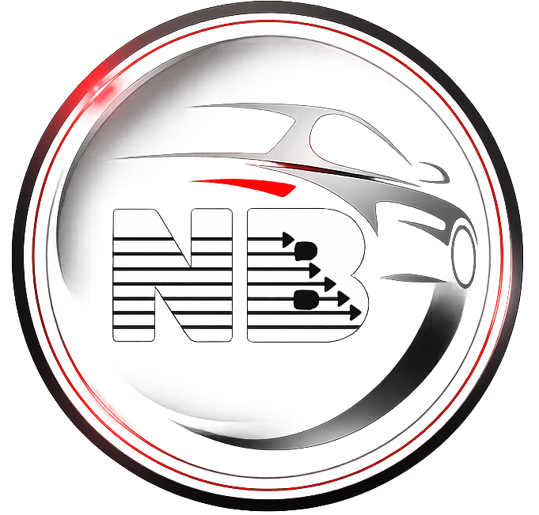

# NB Automobile

## À propos

NB Automobile est une entreprise basée à Paris, spécialisée dans la vente, la location et l'accompagnement à l'achat de véhicules destinés principalement à une clientèle internationale, avec une expertise particulière pour le marché algérien.

Le site a été conçu pour offrir une expérience moderne, fluide et intuitive, permettant aux visiteurs de découvrir les véhicules disponibles, les services proposés et les solutions d'accompagnement jusqu'à la livraison.

## Fonctionnalités

- Présentation moderne de l'entreprise
- Catalogue de véhicules neufs et récents
- Présentation des marques partenaires
- Importation de véhicules vers l'Algérie
- Accompagnement personnalisé
- Interface responsive (ordinateur, tablette et mobile)
- Animations fluides
- Formulaire de contact
- Accès rapide via WhatsApp
- Design premium inspiré des grandes marques automobiles

## Technologies utilisées

- HTML5
- CSS3
- JavaScript (ES6)
- Font Awesome
- Google Fonts
- Responsive Design
- Animations CSS

## Objectifs

Le projet vise à offrir une plateforme élégante et professionnelle permettant :

- de présenter les services de NB Automobile ;
- de mettre en valeur les véhicules disponibles ;
- de renforcer la confiance des clients ;
- de simplifier la prise de contact et les demandes de devis.

## Structure du projet

├── .mgx/
| ├── config
├── index.html
├── style.css
├── script.js
├── img/
├── node_modules/
├── pnpm-lock.yaml
├── package.json
├──template_configuration.json
└── README.md

## Design

Le design repose sur une identité visuelle premium avec :

- Noir profond
- Rouge intense
- Blanc
- Gris métallisé

Inspiré de l'univers Mercedes-Benz, BMW et Audi.

## Développeur

Projet réalisé pour **NB Automobile**.

Paris – France

© Tous droits réservés.
